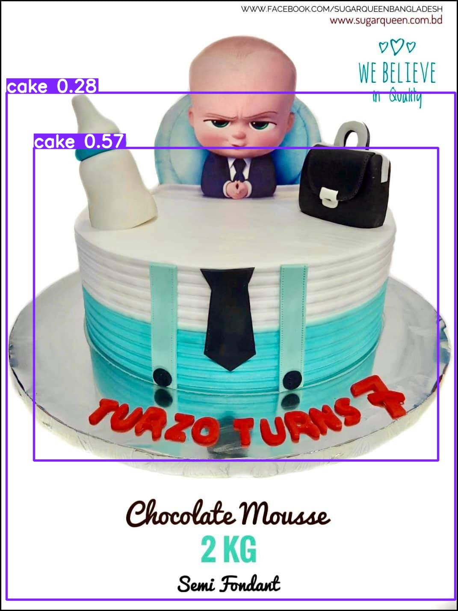
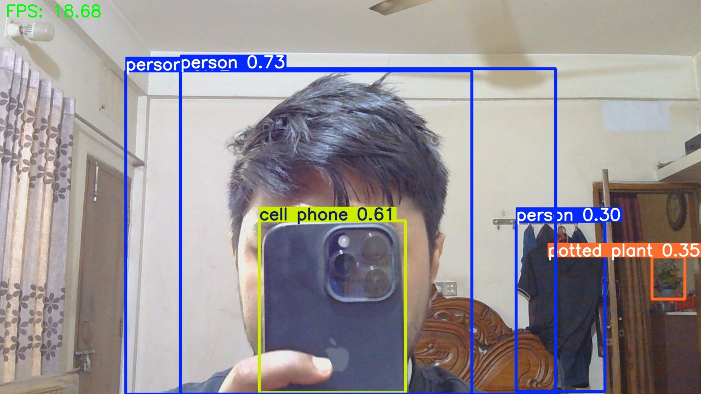

# 🛡️ VisionGuard – Real-Time Object Detection App (YOLOv8)

VisionGuard is a real-time object detection system built with **Python**, **YOLOv8**, **OpenCV**, and **Streamlit**.  
This project will detect objects using a webcam, allow image uploads, and support custom YOLO model training.

## 🚀 Features (Coming Soon)
- Real-time webcam object detection
- Image-based detection
- Streamlit web interface
- Custom YOLO model training support
- Clean, modular Python code

---

## 📁 Project Structure (Initial Setup)

```bash
visionguard/
│
├── app/
│   └── streamlit_app.py
│
├── data/
│   ├── dataset/
│   └── samples/
│
├── models/
│   └── placeholder.txt
│
├── notebooks/
│   └── 01_experiments.ipynb
│
├── outputs/
│   ├── predictions/
│   └── screenshots/
│
├── src/
│   ├── detect_image.py
│   ├── detect_webcam.py
│   ├── train_custom.py
│   └── __init__.py
│
├── requirements.txt
├── README.md
├── LICENSE
└── .gitignore
```


## 🧱 Tech Stack
- Python 3+
- Ultralytics YOLOv8
- OpenCV
- NumPy
- Streamlit

---

## 📌 Note

Detailed documentation will be added as features are developed.  
Stay tuned for updates!

---

## 🎥 Run Real-Time Webcam Detection

Install dependencies:

```bash
pip install -r requirements.txt
```

## 📸 Demo Screenshots

<div align="center">
  
  <br/>
  <em>Annotated YOLOv8 Detection Output</em>
  <br/><br/>
  
  <br/>
  <em>Webcam Snapshot</em>
</div>
