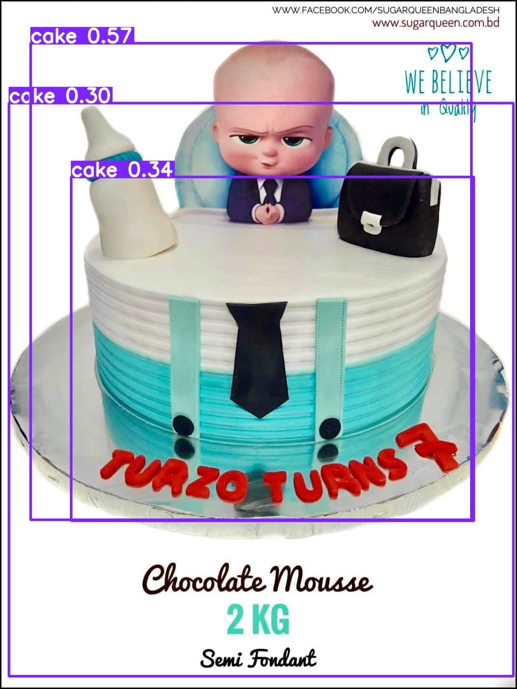

# 🛡️ VisionGuard – Real-Time Object Detection App (YOLOv8)

VisionGuard is a real-time object detection system built with **Python**, **YOLOv8**, **OpenCV**, and **Streamlit**.  
This project will detect objects using a webcam, allow image uploads, and support custom YOLO model training.

## 🚀 Features (Coming Soon)
- ✅ Real-time webcam object detection (OpenCV + YOLOv8)
- ✅ Image-based detection script
- ✅ Custom YOLO training script (with sample dataset)
- ✅ Clean, modular Python code with CLI arguments
- 🕒 Optional Streamlit / GUI interface (planned for future)


## 📂 Project Structure

<!-- TREE START -->
```text
.
├── assets
├── configs
├── data
│   ├── coco128
│   │   ├── images
│   │   │   └── train2017
│   │   └── labels
│   │       └── train2017
│   └── samples
├── models
├── outputs
├── src
│   ├── inference
│   ├── tools
│   ├── training
│   └── utils
└── tools

18 directories
```
<!-- TREE END -->


## 🧱 Tech Stack
- Python 3+
- Ultralytics YOLOv8
- OpenCV
- NumPy
- Streamlit


## 🎥 Run Real-Time Webcam Detection

## Install dependencies:

```bash
pip install -r requirements.txt
```

```bash
python src/detect_webcam.py --source 0 --flip
```
## Run detection on a single image
```bash
python src/detect_image.py --image data/samples/demo.jpg --weights yolov8n.pt --output outputs
```
## 📸 Demo Screenshots

<div align="center">
  
  <br/>
  <em>Annotated YOLOv8 Detection Output</em>
  <br/><br/>
  
  <br/>
  <em>Webcam Snapshot</em>
</div>
